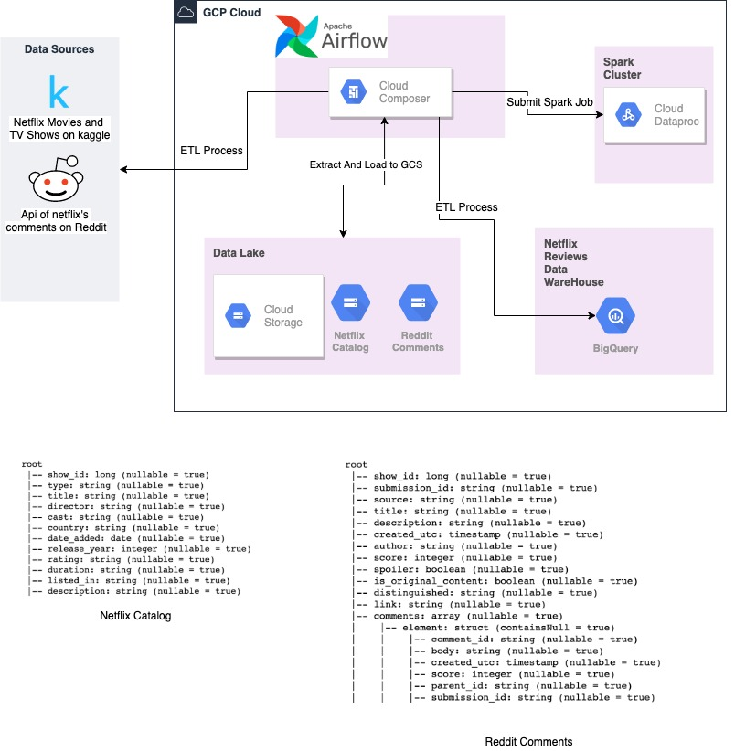
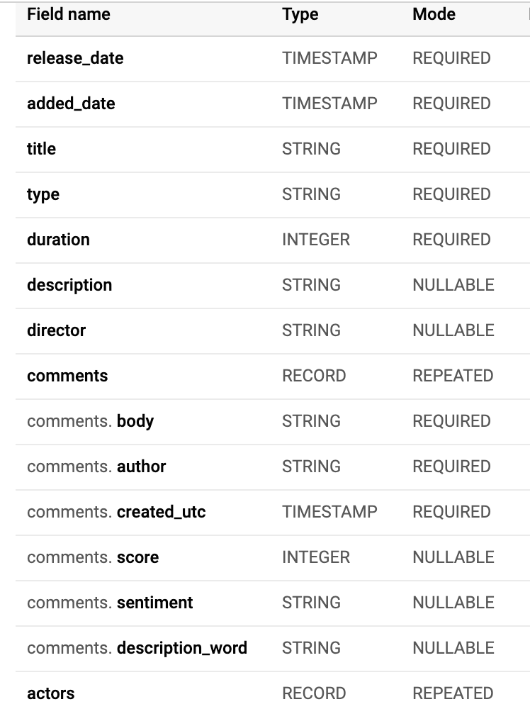

# Netflix Content Review

## Summary
This project is a data pipeline created with the intention of generating data related to netflix's content opinion on reddit, this data will serve a twitter bot that will tweet every time someone write on reddit about a certain movie o serie that is on netflix content catalog, also a datawarehouse will be created to serve an analytics dashboard where we will answers a few questions. To achieve this we used the following datasources:

* [Kaggle Netflix Movies and TV Shows DataSet](https://www.kaggle.com/shivamb/netflix-shows/data#) 
* [Reddit api](https://www.reddit.com/dev/api)

## Assumptions
For the propouse of this project the following assumptions will be made: 
* A movie with the same title and director but with different release date and duration will be saved as one.   

## Architecture 

#### BigQuery table structure

## Pre Requisite
Python 3.5 or later
Jupyter Notebook 

## Configuration

### Airflow Variables:
* **gc_project_id**: refers to the id of you project in google cloud.
* **gc_region**: refers to the region that in which you created all the components in gcp.
* **is_consume_show_comments_enable**: False indicate that you want to auto-generate comments of shows for testing purpose.
* **reddit_client_id**: if the variable is_consume_show_comments_enable is set to True you have to set the id associated to 
a client app created in the reddit page. 
* **reddit_client_secret**: if the variable is_consume_show_comments_enable is set to True you have to add the secret key 
associated to a client app created in the reddit page.

### Airflow Connections: 
* name: google_cloud_connection, type: google_cloud_platform 

### Storage folder structure

You should create the following bucket and folders structure in gcs: Bucket name = netflix-content

* netflix-content/catalog/clean
* netflix-content/catalog/raw
* netflix-content/comments/clean
* netflix-content/comments/raw
* netflix-content/spark-jobs

### Project Settings: 
* The following docker image was used to deploy the project [airflow-pipeline](https://github.com/brayanjuls/airflow-pipeline)

* praw.ini = File to add properties related to reddit like the authentication credentials

* XDG_CONFIG_HOME = Enviroment variable to set the folder path where the praw.init file is going to live
